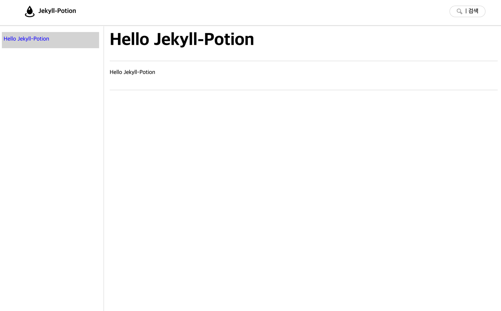

# jekyll-potion

## 소개

Jekyll-Potion 은 [Jekyll](https://jekyllrb.com/) 기반의 NUGU developers 문서 사이트 제작을 위해 작성된 도구로서, 향후 유사한 형태의 문서 사이트 구축시 빠르고 쉽게 작업할 수 있도록 고려된 도구입니다.
  
[Jekyll](https://jekyllrb.com/) 은 매우 편리한 도구이지만 적절한 테마를 고르고 테마환경을 학습하기 위한 사전 준비 작업이 필요하며, 문서 작성자가 markdown 문법 이외에도 [Jekyll](https://jekyllrb.com/) 의 사용법도 필히 익혀야만 합니다.

## 목표

* markdown 문법을 알고만 있다면, 문서 작성자는 문서 작성에만 신경을 쓸 수 있도록 함
* [Jekyll](https://jekyllrb.com/) 기반의 문서를 [GitHub Pages](https://pages.github.com/) 로 포팅시 빠르게 포팅하며, [custom domain](https://docs.github.com/en/pages/configuring-a-custom-domain-for-your-github-pages-site) 또는 직업 호스팅을 하는 경우라도 추가적인 작업을 최소화
* WIKI 와 유사한 문서 구조(이하 `디렉토리 구조`)로 문서 작성시 구조화 작업 최소화

## key feature

* Jekyll-Potion 은 [Collections](https://jekyllrb.com/docs/collections/) 기반이 아닌 `디렉토리 기반`의 문서 구조에 적합합니다.
  * `디렉토리 구조`로 문서를 작성한 경우, 이를 바탕으로 별도의 설정없이 구조화된 페이지 목록을 제공합니다.
    > `디렉토리 구조` 란 WIKI 와 유사하게 상위 페이지, 하위 페이지 로서 표현되는 형태로서 파일 시스템에서 페이지를 작성하고 파일명과 동일한 디렉토리를 만든 후 그 안에 페이지를 작성하여 하위 페이지로서 표현하는 구조를 의미합니다.
  * 이를테면, 다음의 파일 시스템 구조를 갖추면
    
    
  * 다음과 같이 표현됩니다.
  
    
  * 구성된 페이지 목록은 약속된 순서에 의해 `이전`, `다음` 페이지에 대한 pagination 을 제공합니다.
  * [Front-Matter](https://jekyllrb.com/docs/front-matter/) 의 설정이 없어도 markdown 페이지인 경우, 자동으로 문서화하며 별도의 문서 제목이 없어도 문서의 제목을 자동으로 추출합니다.

* Jekyll-Potion 은 페이지에 대한 HTML meta 데이터를 자동으로 생성합니다.
  * 별도의 설정이 없어도, 페이지의 생성, 갱신 일자를 추출하여, HTML meta 태그로 생성합니다.
  * 간단한 favicon 설정을 통해 사이트의 favicon 설정을 할 수 있습니다.
  * 자동으로 추출한 문서 데이터를 기반으로 HTML og 태그를 자동으로 생성할 수 있습니다.

* Jekyll-Potion 은 [GitHub Pages](https://docs.github.com/en/pages/quickstart) 로 전환할 경우, 이후 [custom domain](https://docs.github.com/en/pages/configuring-a-custom-domain-for-your-github-pages-site) 으로 적용할 경우 간단한 설정만으로 적용할 수 있습니다.
  * domain 이 있고 없음에 따라 모든 페이지, 이미지의 링크를 Jekyll 속성을 markdown 문서에 추가해야 하는 문제를 상대 경로로 작성된 모든 링크, 이미지의 경로를 상황에 맞게 자동으로 절대 경로로 변경합니다.
    > 문서 작성을 위해 Jekyll 를 학습하거나, markdown 문서에 liquid 태그를 사용하지 않고 훼손되지 않은 markdown 문서를 작성할 수 있습니다.

* Heading 태그 (`<h1>` ~ `<h6>`) 로 표현되는 markdown 구문(`#` ~ `######`)을 작성시 자동으로 링크를 복사할 수 있는 마크업 요소를 추가합니다.
  > 페이지간 연결을 위한 작업은 간단히 링크를 복사하는 것만으로 충분합니다.
 
* 문서의 추출 가능한 모든 text 를 추출하여, 검색에서 사용할 수 있는 index(json) 파일을 자동으로 생성하며, 이를 활용할 수 있는 javascript 를 기본적으로 제공합니다.
  > javascript 는 생성되는 HTML head 에 자동으로 import 되며 정의된 API 를 통해 사용하기만 하면 됩니다. 

* markdown 으로만 표현이 불가능한 요소를 liquid custom 태그로 작성된 태그를 통해 보다 풍부한 문서를 작성할 수 있습니다.
  > 작성된 태그를 지원하기 위한 javascript 는 별도의 설정이 없어도, 자동으로 HTML head 에 자동으로 import 되며 정의된 API 를 통해 사용하기만 하면 됩니다. 

* [Jekyll Spaceship](https://github.com/jeffreytse/jekyll-spaceship) 을 내장하여, 보다 다양한 표현이 가능합니다.
  * Youtube 또는 지원가능한 미디어 사이트의 표현은 링크만 걸어도 표현할 수 있습니다.
  * 테이블에서 `<br>` 태그를 지원하여, 테이블 작성이 매우 편리합니다.
  * 수식을 표현할 때에도 MathJax 를 이용해 표현이 가능합니다.
  > Jekyll-Potion 은 항상 [Jekyll Spaceship](https://github.com/jeffreytse/jekyll-spaceship) 이후에 동작하며. Jekyll Potion 에 의해 변경된 content 를 라이브러리 정책에 맞게 변경할 수 있습니다. 

## 시작하기

### 사전 준비

1. 참여하는 모든 인원은 [Jekyll](https://jekyllrb.com/) 이 설치되어야 합니다. [설치 가이드](https://jekyllrb.com/docs/installation/) 를 참고하여 시스템 환경에 맞게 설치합니다.
2. Jekyll-Potion 은 사이트 운영자, 문서 작성자가 다름을 간주합니다.
   * 사이트 운영자는 반드시 [Jekyll](https://jekyllrb.com/) 에 대한 사용법을 숙지해야 합니다. 만일 [GitHub Pages](https://pages.github.com/) 포팅을 고려한다면, Git 에 대한 사용법을 숙지해야 합니다.
   * 문서 작성자는 기본적으로 markdown 문법을 이해하고 있어야 합니다. 또한 로컬 PC 에서 문서 작성시 서버 구동을 위해 최소한 [Quickstart](https://jekyllrb.com/docs/) 정도는 숙지해야 합니다.
     > 문서 작성자가 로컬 PC 에서 문서를 작성하는 것은 필수사항이 아닙니다. 사이트 운영자가 정의한 운영 환경에 따라 GitHub 저장소를 fork 하여, online 으로 문서를 작성하고 개인의 페이지를 온라인에서 확인하는 것도 얼마든지 가능합니다.  
3. Jekyll-Potion 은 기본적으로 세팅된 theme 를 통해 설치만으로도 충분히 사이트 요소를 표현할 수 있습니다. 하지만, 만일 사이트를 좀 더 아름답게 꾸미기 위해서는 반드시 마크업, 디자인이 필요하며 마크업 개발자, 디자이너 인력에 대한 고려가 이뤄져야 합니다.

### 설치
아무런 컨텐츠가 준비되지 않은 경우, `처음 시작하기` 를 기준으로 설치합니다. 만일 이미 markdown 문서가 준비되어 있다면, `마이그레이션 하기` 를 기준으로 설치합니다. 

#### 처음 시작하기
현재 jekyll-potion 은 Gem 으로서 동작하지 않는 Beta 버전입니다. 향후 Gem 으로 설치할 수 있는 작업이 준비가 될 때까지 불편하더라도 아래의 설치과정을 거쳐야 합니다.

1. Jekyll 사이트를 생성합니다.
   ```bash
   jekyll new {site_name}
   ```
2. {site_name} 으로 이동한 후 아래의 작업을 진행합니다.
   * _`_posts` 폴더 삭제
       > jekyll-potion 은 post 기반으로 동작하지 않습니다.
   * `Gemfile` 삭제
   * `about.markdown` 삭제
   * `index.markdown` 삭제
   * `_config.yml` 삭제
   * `404.html` 삭제
3. GitHub 저장소 본문 우측 상단에 `Code` 버튼을 누르고 `Download ZIP` 을 선택하여 zip 파일을 다운로드 합니다.
   
   
4. 압축을 해제한 후, 다음의 작업을 진행합니다.
   * `_jekyll-potion` 폴더 복사
   * `_plugins` 폴더 복사
   * `assets` 폴더 복사
   * `Gemfile` 복사
   * `_config.yml` 복사
   * `_config.jekyll_potion.yml` 복사
   * `404.html` 복사
   * `_index.md` 복사 이후 `index.md` 파일로 이름 변경
5. Bundle update
   ```bash
   bundle update
   ```
6. 서버 실행
   ```bash
   bundle exec jekyll serve --config _config.yml,_config.jekyll_potion.yml --trace
   ```
7. 웹브라우저로 `http://127.0.0.1:4000` 주소를 접속하여 아래의 화면 확인
   

#### 마이그레이션 하기
우선 가장 중요한 것은 구성된 문서 구조가 `디렉토리 구조`에 적합한지 입니다. 만일 이 구조에 맞지 않는 문서라면 jekyll-potion을 적용할 수 없습니다.

이 구조에 준한다면, 문서만 있는 경우와, 이미 [Jekyll](https://jekyllrb.com/) 이 적용된 경우 2가지로 구분하여 설치할 수 있습니다. 

##### markdown 문서만 있는 경우
1. `처음 시작하기` 과정을 거친 이후 서버까지 구동된 상태라면, 문서 목록을 사이트 최상위 디렉토리로 복사를 합니다.
   
   
2. 복사된 이후 위 이미지가 노출된다면, 웹브라우저를 갱신하여, 좌측 메뉴 목록에 추가된 페이지가 구조화된 채로 잘 표현되는지를 확인합니다. 

##### [Jekyll](https://jekyllrb.com/) 이 적용된 경우
###### 사전 확인 사항
이 경우라면, 해당 사용자가 [Jekyll](https://jekyllrb.com/) 에 대한 사전 지식을 가지고 있음을 간주합니다.

jekyll-potion 은 아래의 버전을 기준으로 작업이 되었습니다. 이미 다른 버전을 사용한 경우라면 버전의 조정이나 호환성 검증이 필요합니다.

| 라이브러리                                                               | 버전     |
|---------------------------------------------------------------------|--------|
| [Jekyll](https://jekyllrb.com/)                                     | 4.2.2  |
| [Jekyll Spaceship](https://github.com/jeffreytse/jekyll-spaceship)  | 0.10.2 |
| [Nokogiri](https://github.com/sparklemotion/nokogiri)               | 1.13.6 |

기존에 사용중인 layout 이 있다 하더라도, jekyll-potion 의 기본 내장 theme 로 전환됨을 간주합니다.
  > font-matter 를 통해 기존에 사용중인 페이지 별 layout 이 있다면 이를 모두 제거합니다. jekyll-potion 의 기본 내장 theme 는 default, error 2가지 layout 으로 구성되며, 특별한 layout 설정이 없는 경우 default 로 변경합니다.  

모든 markdown 페이지는 오직 markdown 문법에 맞는 요소들로만 구성된 문서임을 간주합니다.
  > 만일 path 를 `https://{user_name}.github.io/{repository_name}/` 또는 도메인 주소에 맞도록 liquid 구문을 통해 경로를 조작하여 절대경로화 시킨 경우라면 제거하고, 상대경로 변경합니다. jekyll-potion 은 모든 a, img 태그를 조회하여 상대 경로로 판단되면, jekyll config 설정을 통해 유추된 절대경로로 치환합니다. 

이미 [Jekyll Spaceship](https://github.com/jeffreytse/jekyll-spaceship) 를 사용중일 경우 그리고 버전에 이슈가 없다면, 용도에 맞게 조정해도 무방합니다.

jekyll-potion 이 기본적으로 제공하는 liquid 태그는 아래와 같습니다. 만일 아래의 태그중 동일한 이름의 태그가 존재한다면 변경이 필요합니다.

| 태그         | 설명                                                             |
|------------|----------------------------------------------------------------|
| alerts     | Bootstrap 의 Alerts 와 같은 역활을 합니다                                |
| api        | API 명세를 상세히 기술합니다.                                             |
| code       | 코드 블럭에 제목을 입력할 수 있으며, `{{}}` 구문을 raw 하게 표현합니다. 또한 복사기능을 제공합니다. |
| empty      | 컨텐츠가 비워진 화면의 하위 페이지가 존재한다면 목록화하여 보여줍니다.                        |
| file       | 내부 파일 다운로드 기능을 제공합니다.                                          |
| link       | 내/외부 링크를 구분하여, 외부링크의 경우 제목, 설명을 보강하여 표현합니다.                    |
| logo       | 사이트의 이미지, 타이틀을 표현합니다.                                          |
| navigation | 사이트의 `디렉토리 구조` 를 통해 메뉴를 구성합니다.                                 |
| pagination | 일정한 규칙에 의해 정의된 페이지의 순서를 통해, 이전, 다음 페이지를 표현합니다.                 |
| tabs       | Bootstrap 의 Tabs 역활을 합니다.                                      |

jekyll-potion 은 페이지를 렌더링 할 때 HTML head 태그에 다양한 정보를 포함합니다. 아래의 정보를 이미 사용중이라면 제거합니다.

| HTML 태그                              | 구분      | 필수                                                            |
|--------------------------------------|---------|---------------------------------------------------------------|
| meta[name='Date']                    | -       | O                                                             |
| meta[name='Last-Modified']           | -       | O                                                             |
| meta[name='msapplication-TileColor'] | favicon | `jekyll_potion.site.favicon` 제거시 사용하지 않음                      |
| meta[name='msapplication-TileImage'] | favicon | `jekyll_potion.site.favicon` 제거시 사용하지 않음                      |
| meta[name='theme-color']             | favicon | `jekyll_potion.site.favicon` 제거시 사용하지 않음                      |
| link[rel='apple-touch-icon']         | favicon | `jekyll_potion.site.favicon` 제거시 사용하지 않음                      |
| link[rel='icon']                     | favicon | `jekyll_potion.site.favicon` 제거시 사용하지 않음                      |
| meta[property='og:url']              | og      | `jekyll_potion.processor.make_og_tag_processor` 제거시 사용하지 않음   |
| meta[property='og:type']             | og      | `jekyll_potion.processor.make_og_tag_processor` 제거시 사용하지 않음   |
| meta[property='og:title']            | og      | `jekyll_potion.processor.make_og_tag_processor` 제거시 사용하지 않음   |
| meta[property='og:description']      | og      | `jekyll_potion.processor.make_og_tag_processor` 제거시 사용하지 않음   |
| meta[property='og:image']            | og      | `jekyll_potion.processor.make_og_tag_processor` 제거시 사용하지 않음   |

이외에도 기본 theme에 자체 내장된 javascript, css 파일이 자동으로 HTML `<head>` 태그에 추가됩니다. 추가되는 파일은 다음과 같으며, 중복이거나, 충돌이 발생할 경우 제거합니다.

| 파일명                                    | 설명                            | 필수                                                                | 
|----------------------------------------|-------------------------------|-------------------------------------------------------------------|
| _/assets/base/base/jquery-3.6.0.min.js |                               | O                                                                 |
| _/assets/base/base/code.js             | code 태그 구동 script             | O                                                                 |
| _/assets/base/base/header.js           | `h1` ~ `h6` 태그 지원 script      | `jekyll_potion.processor.make_header_link_processor` 제거시 사용하지 않음  |
| _/assets/base/base/navigation.js       | navigation 태그 구동 script       | O                                                                 |
| _/assets/base/base/search.js           | 검색 구동 script                  | `jekyll_potion.processor.make_search_index_processor` 제거시 사용하지 않음 |
| _/assets/base/base/search.json         | search index 파일               | `jekyll_potion.processor.make_search_index_processor` 제거시 사용하지 않음 |
| _/assets/base/base/tabs.js             | tabs 태그 구동 script             | O                                                                 |
| _assets/css/main.css                   | 기본 theme stylesheet           | O                                                                 |
| _assets/css/main.css.map               | 기본 theme stylesheet map       | O                                                                 |
| _assets/css/syntax.css                 | 기본 theme 코드 블럭 stylesheet     | O                                                                 |
| _assets/js/jsrender.min.js             | 검색 결과 template 렌더링 script     | O                                                                 |
| _assets/js/jsrender.min.js.map         | 검색 결과 template 렌더링 script map | O                                                                 |
| _assets/js/main.js                     | 기본 theme 구동 script            | O                                                                 |

###### 이관 준비 #1
`사전 확인 사항` 에 문제가 없다면 다음의 절차를 통해 이관작업을 진행합니다.

4. `처음 시작하기` 3번 과정을 통해 zip 파일을 다운받은 후 압축을 해제하고 아래의 작업을 진행합니다.
   * `_jekyll-potion` 폴더 복사
   * `_plugins/jekyll-potion.rb` 복사
   * `assets` 폴더 복사
     > 만일 `_config.jekyll_potion.yml` 설정중 `jekyll_potion.site.icon`, `jekyll_potion.site.favicon`을 사용하지 않는다면 복사하지 않아도 됩니다.
   * `404.html` 복사
   * `_config.jekyll_potion.yml` 복사한 후 아래의 요소 검토

| 요소                            | 설명                                                                                                                                                                                                                                |
|-------------------------------|-----------------------------------------------------------------------------------------------------------------------------------------------------------------------------------------------------------------------------------|
| collections                   | jekyll-potion 은 기본적으로 collection 을 사용하지 않습니다.                                                                                                                                                                                     |
| markdown                      | `kramdown` 을 사용하고 있으며, `kramdown` 을 이미 사용한다면, jekyll-potion 의 설정을 제거합니다.                                                                                                                                                          |
| sass                          | jekyll-potion 은 별도의 life-cycle 을 통해 scss 파일을 생성합니다. 이미 설정이 있다면 jekyll-potion 의 설정을 제거합니다.                                                                                                                                         |
| plugins                       | jekyll-potion 은 종속성은 없지만, [Jekyll Spaceship](https://github.com/jeffreytse/jekyll-spaceship) 사용을 간주하고 개발되었습니다. 사용에 문제가 없다면 그대로 둡니다.                                                                                               |
| jekyll_potion.site.index_page | jekyll-potion 은 기본적으로 index.md 파일을 시작페이지로 사용하고, `README.md` 파일은 GitHub 소개페이지로서 사용하여, content 에서 제거합니다. 이를 다른 페이지로 변경하고자 한다면, `jekyll_potion.site.index_page` 를 해당 페이지로 변경한 후 `jekyll_potion.site.exclude` 에 해당 파일이 존재할 경우 제거합니다.  |
| jekyll_potion.site.permalink  | jekyll-potion 은 기본적으로 모든 페이지의 `permalink` 를 `/:path/:basename` 로 통일합니다. 만일 다른 형태의 `permalink` 를 적용중이면 제거합니다.                                                                                                                      | 
| jekyll_potion.site.title      | 사이트의 title 로서 이미 title 이 존재하더라도, 다시 한번 입력합니다.                                                                                                                                                                                     | 
| jekyll_potion.site.icon       | 사이트의 icon 을 가르킵니다. 필요가 없다면 해당 설정을 제거합니다.                                                                                                                                                                                          | 
| jekyll_potion.site.favicon    | 사이트의 favicon 을 가르킵니다. 필요가 없다면 해당 설정을 제거합니다.                                                                                                                                                                                       |
| processor                     | 각각의 processor 들은 jekyll-potion 의 기본 theme 를 사용시 권장됩니다.                                                                                                                                                                            |                                                                                                                                                                          | make_navigation_processor 는 `디렉토리 구조`를 통해 메뉴 영역을 구성합니다. 필요가 없다면, 제거해도 상관없으나, 화면 좌측 영역이 비어있게 됩니다. |

###### 이관 준비 #2
`이관 준비 #1` 단계에서 문제가 없다면 서버를 구동시킵니다. jekyll-potion 은 별다른 설정이 없다면, `http://127.0.0.1:4000` 로 구동되나, `_config.yml` 을 통해 `baseurl`이나, `url`을 변경했다면 변경된 주소를 입력합니다.


위와 같은 layout을 유지한 채로 컨텐츠가 오류없이 표현된다면, 적용에 성공한 것입니다!
