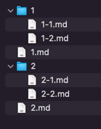

# jekyll-potion

## 소개

`jekyll-potion` 은 [Jekyll](https://jekyllrb.com/) 기반의 NUGU developers 문서 사이트 제작을 위해 작성된 도구로서, 향후 유사한 형태의 문서 사이트 구축시 빠르고 쉽게 작업할 수 있도록 고려된 도구입니다.
  
[Jekyll](https://jekyllrb.com/) 은 매우 편리한 도구이지만 적절한 테마를 고르고 테마환경을 학습하기 위한 사전 준비 작업이 필요하며, 문서 작성자가 markdown 문법 이외에도 [Jekyll](https://jekyllrb.com/) 의 사용법도 필히 익혀야만 합니다.

## 목표

* markdown 문법을 알고만 있다면, 문서 작성자는 문서 작성에만 신경을 쓸 수 있도록 함
* [Jekyll](https://jekyllrb.com/) 기반의 문서를 [GitHub Pages](https://pages.github.com/) 로 포팅시 빠르게 포팅하며, [custom domain](https://docs.github.com/en/pages/configuring-a-custom-domain-for-your-github-pages-site) 또는 직업 호스팅을 하는 경우라도 추가적인 작업을 최소화
* WIKI 와 유사한 문서 구조(이하 `디렉토리 구조`)로 문서 작성시 구조화 작업 최소화

## key feature

* `jekyll-potion` 은 [Collections](https://jekyllrb.com/docs/collections/) 기반이 아닌 `디렉토리 기반`의 문서 구조에 적합합니다.
  * `디렉토리 구조`로 문서를 작성한 경우, 이를 바탕으로 별도의 설정없이 구조화된 페이지 목록을 제공합니다.
    > `디렉토리 구조` 란 WIKI 와 유사하게 상위 페이지, 하위 페이지 로서 표현되는 형태로서 파일 시스템에서 페이지를 작성하고 파일명과 동일한 디렉토리를 만든 후 그 안에 페이지를 작성하여 하위 페이지로서 표현하는 구조를 의미합니다.
  * 이를테면, 다음의 파일 시스템 구조를 갖추면
    
    
  * 다음과 같이 표현됩니다.
  
    
  * 구성된 페이지 목록은 약속된 순서에 의해 `이전`, `다음` 페이지에 대한 pagination 을 제공합니다.
  * [Front-Matter](https://jekyllrb.com/docs/front-matter/) 의 설정이 없어도 markdown 페이지인 경우, 자동으로 문서화하며 별도의 문서 제목이 없어도 문서의 제목을 자동으로 추출합니다.

* `jekyll-potion` 은 페이지에 대한 HTML meta 데이터를 자동으로 생성합니다.
  * 별도의 설정이 없어도, 페이지의 생성, 갱신 일자를 추출하여, HTML meta 태그로 생성합니다.
  * 간단한 favicon 설정을 통해 사이트의 favicon 설정을 할 수 있습니다.
  * 자동으로 추출한 문서 데이터를 기반으로 HTML og 태그를 자동으로 생성할 수 있습니다.

* `jekyll-potion` 은 [GitHub Pages](https://docs.github.com/en/pages/quickstart) 로 전환할 경우, 이후 [custom domain](https://docs.github.com/en/pages/configuring-a-custom-domain-for-your-github-pages-site) 으로 적용할 경우 간단한 설정만으로 적용할 수 있습니다.
  * domain 이 있고 없음에 따라 모든 페이지, 이미지의 링크를 Jekyll 속성을 markdown 문서에 추가해야 하는 문제를 상대 경로로 작성된 모든 링크, 이미지의 경로를 상황에 맞게 자동으로 절대 경로로 변경합니다.
    > 문서 작성을 위해 Jekyll 를 학습하거나, markdown 문서에 liquid 태그를 사용하지 않고 훼손되지 않은 markdown 문서를 작성할 수 있습니다.

* Heading 태그 (`<h1>` ~ `<h6>`) 로 표현되는 markdown 구문(`#` ~ `######`)을 작성시 자동으로 링크를 복사할 수 있는 마크업 요소를 추가합니다.
  > 페이지간 연결을 위한 작업은 간단히 링크를 복사하는 것만으로 충분합니다.
 
* 문서의 추출 가능한 모든 text 를 추출하여, 검색에서 사용할 수 있는 index(json) 파일을 자동으로 생성하며, 이를 활용할 수 있는 javascript 를 기본적으로 제공합니다.
  > javascript 는 생성되는 HTML head 에 자동으로 import 되며 정의된 API 를 통해 사용하기만 하면 됩니다. 

* markdown 으로만 표현이 불가능한 요소를 liquid custom 태그로 작성된 태그를 통해 보다 풍부한 문서를 작성할 수 있습니다.
  > 작성된 태그를 지원하기 위한 javascript 는 별도의 설정이 없어도, 자동으로 HTML head 에 자동으로 import 되며 정의된 API 를 통해 사용하기만 하면 됩니다. 

* [Jekyll Spaceship](https://github.com/jeffreytse/jekyll-spaceship) 을 내장하여, 보다 다양한 표현이 가능합니다.
  * Youtube 또는 지원가능한 미디어 사이트의 표현은 링크만 걸어도 표현할 수 있습니다.
  * 테이블에서 ` ` 태그를 지원하여, 테이블 작성이 매우 편리합니다.
  * 수식을 표현할 때에도 MathJax 를 이용해 표현이 가능합니다.
  > `jekyll-potion` 은 항상 [Jekyll Spaceship](https://github.com/jeffreytse/jekyll-spaceship) 이후에 동작하며. Jekyll Potion 에 의해 변경된 content 를 라이브러리 정책에 맞게 변경할 수 있습니다. 

자세한 설명은 `jekyll-potion` 이 적용된 데모사이트이자, 설명 사이트인 [jekyll-potion](https://nugudevelopers.github.io/jekyll-potion) 을 통해 확인하실 수 있습니다.
