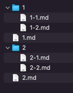

# 시작하기

## 사전 준비

### 참여 인원에 대한 준비

\1. 참여하는 인원은 사이트 관리자, 문서 작성자 로 구분되어 있음을 간주합니다.

* 사이트 관리자는 문서의 형상관리가 가능해야 하며, 이를 통해 문서의 배포 주기를 관리합니다.
* 문서 작성자는 markdown 문서를 제작하고, `jekyll-potion` 에서 제공하는 다양한 기능을 사용할 수 있습니다.


참여하는 모든 인원은 공동작업을 위해 GitHub 에 대한 기본 사용법을 숙지하고 있어야 합니다.

또한 로컬 PC 에서 문서 작성을 한다면, 서버 구동을 위해 최소한 [Quickstart](https://jekyllrb.com/docs/) 정도는 숙지해야 합니다.


\2. 참여하는 인원은 [Jekyll](https://jekyllrb.com/) 이 가능하면 설치되어야 합니다. [설치 가이드](https://jekyllrb.com/docs/installation/) 를 참고하여 시스템 환경에 맞게 설치합니다.


반드시 모든 인원이 반드시 [Jekyll](https://jekyllrb.com/) 이 설치되어야 하는 것은 아닙니다. [GitHub Pages](https://pages.github.com/) 로 개발환경을 갖추었다면, 설치하지 않고 GitHub 를 통해 간단한 편집이 가능합니다.

하지만 어떤 이 경우도 최소한의 GitHub 의 사용법은 숙지하고 있어야 합니다.


\3. 사이트 운영자는 반드시 [Jekyll](https://jekyllrb.com/) 의 운영관리에 대한 사용법을 숙지해야 합니다.


`jekyll-potion` 은 개인 호스팅도 가능하지만, [GitHub Pages](https://pages.github.com/) 의 적용을 염두하고 제작되었습니다. 따라서 반드시 구성원은 GitHub 저장소에 대한 `commit`, `pull-request` 방법을 익혀야 하며, 사이트 관리자는 이를 통해 코드 형상을 관리해야 하기 때문에 Git 을 통한 형상관리가 가능해야 합니다.


\4. `jekyll-potion` 은 기본적으로 세팅된 theme 를 통해 설치만으로도 충분히 사이트 요소를 표현할 수 있습니다. 하지만, 만일 사이트를 서비스에 맞도록 꾸미기 위해서는 반드시 마크업, 디자인이 필요하며 `마크업 개발자`, `디자이너` 인력에 대한 고려가 이뤄져야 합니다.

### 구성 환경 준비

`jekyll-potion` 은 아래의 버전을 기준으로 작업이 되었습니다. 이미 다른 버전을 사용한 경우라면 버전의 조정이나 호환성 검증이 필요합니다.

| 라이브러리                                                 |     버전     |
|-------------------------------------------------------|:----------:|
| [Jekyll](https://jekyllrb.com/)                       | `>=` 4.2.2 |
| [Nokogiri](https://github.com/sparklemotion/nokogiri) |   1.13.6   |

## 설치

### `jekyll-potion` 설치

`jekyll-potion` 은 사이트의 설치할 사이트의 Gemfile, config 파일(ex> _config.yml) 에 아래의 내용을 추가함으로서 사용이 가능합니다.


```ruby
group :jekyll_plugins do
  gem "jekyll-potion", "1.0.1"
end
```



```yaml
plugins:
  - jekyll-potion
```


### 기본 설정

`jekyll-potion` 은 위 설치과정을 마친 경우 설정을 추가하지 않아도 기본적으로 동작하나 세부적인 설정이 필요한 경우 [설정](./config) 를 참고해주세요. 

### 사용

`jekyll-potion` 에서 계층구조를 갖는 문서를 만드려면 하위 문서들이 있는 디렉토리, 디렉토리와 동일한 파일명을 갖는 상위 페이지가 필요합니다.

예를 들면 아래와 같이 작성할 경우



아래와 같이 표현됩니다.


위 구조를 바탕으로 사이트 구성에 도움을 주는 [Processor](./use/processor), 문서 내 기본적인 markdown 이외에 템플릿 요소를 사용할 수 있는 [Tag](./use/tag) 를 참조하여 `jekyll-potion` 을 이용해 문서 작성을 할 수 있습니다.


`jekyll-potion` 을 이용할 경우, [Jekyll](https://jekyllrb.com/) 의 [Themes](https://jekyllrb.com/docs/themes/) 를 사용할 수 없습니다. `jekyll-potion` 은 구동시점에 설정파일의 theme 를 `jekyll-potion` 의 theme 를 사용할 수 있도록 변경합니다.


### favicon 적용

사이트에 favicon 을 적용하려면 [favicon 적용](./start/favicon.md) 문서를 참고하세요.

### Custom Theme 생성

`jekyll-potion` 에 별도의 설정을 하지 않은 경우 기본 theme 인 `proto` 를 사용합니다. 만일 자체적인 theme 를 사용하려면 [theme 생성](./start/make-theme) 문서를 참고하세요.

### GitHub 적용

구성한 사이트를 [GitHub Pages](https://pages.github.com/) 에 적용하려면 [GitHub Pages 적용](./start/apply-github-pages) 문서를 참고하세요.