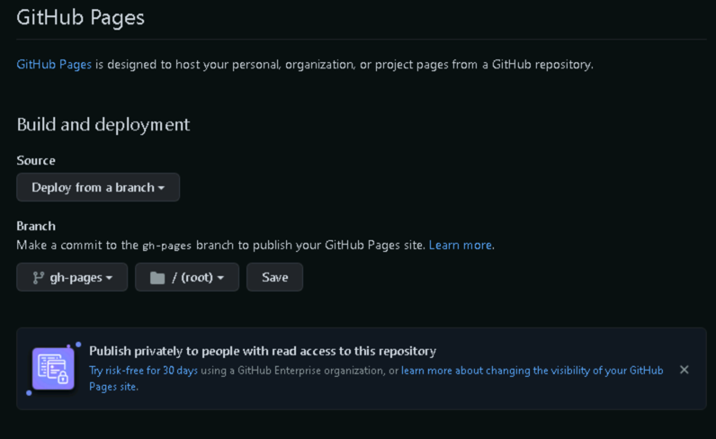

# GitHub Pages 적용

`jekyll-potion` 은 [Using workflows](https://docs.github.com/en/actions/using-workflows) 를 통해 [GitHub Pages](https://pages.github.com/) 적용이 가능하며 아래의 과정을 진행하세요.

GitHub 저장소의 생성, workflows 사용을 위한 [Personal Access Token](https://docs.github.com/en/authentication/keeping-your-account-and-data-secure/creating-a-personal-access-token) 등록 과정은 생략합니다. 

## workflow 생성

workflow 는 GitHub 에서 지원하는 특정 상황(push, pull-request 등)을 체크하여, 사후작업을 수행하는 기능이며, 이 기능을 통해 GitHub 에서 제공하는 라이브러리 이외에 라이브러리를 사용하는 [Jekyll](https://jekyllrb.com/) 빌드할 수 있습니다.

GitHub 저장소 최상단에 `.github/workflows` 디렉토리를 생성하고, 아래 내용의 yml 파일을 생성하고 push 합니다.


```yaml
name: Jekyll site CI

on:
  push:
    branches: [ main ]

jobs:
  build:

    runs-on: ubuntu-latest

    steps:
    - uses: actions/checkout@v2

    # Use GitHub Actions' cache to shorten build times and decrease load on servers
    - uses: actions/cache@v2
      with:
        path: vendor/bundle
        key: ${{ runner.os }}-gems-${{ hashFiles('**/Gemfile.lock') }}
        restore-keys: |
          ${{ runner.os }}-gems-

    # Standard usage
    - uses:  helaili/jekyll-action@v2.3
      with:
        keep_history: true
        target_branch: "gh-pages"
        token: ${{ secrets.GITHUB_TOKEN }}
```


위 문서는 [helaili/jekyll-action](https://github.com/helaili/jekyll-action) 에서 제공되는 기능을 이용했습니다.
  > 지원되는 다른 `GitHub Action` 이 있다면, 그를 사용해도 무방합니다. 

또한 기본 브랜치의 변경이나, `push` 이외에 예를 들어 `pull-request` 등을 통한 문서 빌드를 수행할 경우 아래와 같이 정의함으로서 동작할 수 있습니다.


```yaml
on:
  push:
    branches: [ doc ]
  pull_request:
    branches: [ doc ]
```


빌드 과정에 대한 자세한 설정은 [helaili/jekyll-action](https://github.com/helaili/jekyll-action) 를 참고해주세요.

## 배포시 domain 구성

[GitHub Pages](https://pages.github.com/) 를 참조하여, 기본 URL, 도메인 설정에 맞게 프로젝트를 수정합니다.

만일 context path 기반의 호스팅을 원한다면, [Jekyll](https://jekyllrb.com/) 의 설정파일을 아래와 같이 변경하세요.


```yaml
url: "https://nugudevelopers.github.io"
baseurl: "/jekyll-potion"
```


만일 도메인 기반의 호스팅을 원한다면 [Jekyll](https://jekyllrb.com/) 의 설정파일을 아래와 같이 변경하세요.


```yaml
url: "your domain"
baseurl: ""
```


또한 workflow 를 통한 빌드, 배포임으로 CNAME 파일을 GitHub 저장소에 추가합니다.


```yaml
your domain
```


## GitHub Pages 적용

workflow 파일을 저장소에 push 했다면 GitHub Action 을 통해 문서 사이트의 대상 브랜치인 `gh-pages` 가 생성되었을 겁니다.

이후 GitHub 저장소의 `Settings` > `GitHub Pages` 메뉴에 접근하여 아래의 그림과 같이 설정합니다.


