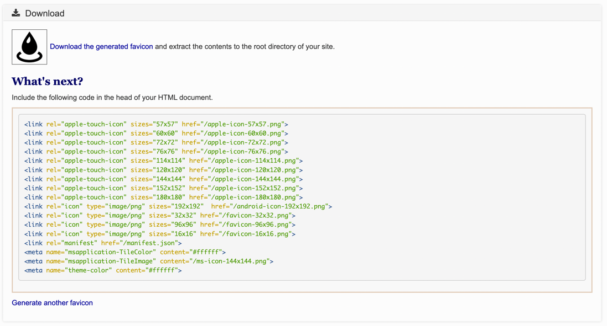

# favicon 적용

`jekyll-potion` 에서 설정하는 `jekyll_potion.site.favicon` 은 online favicon 생성 사이트를 통해 생성된 브라우저 환경에 맞는 HTML 정보가 있는 파일입니다.

아래의 가이드를 통해 favicon 을 적용하세요.

## favicon 생성

[Favicon & App Icon Generator](https://www.favicon-generator.org/) 을 통해 favicon 을 생성합니다.
 > 다른 online favicon 생성 사이트를 통해서 생성해도 무방합니다.

생성을 마치면 아래와 같은 HTML 요소와 다운로드 링크가 생성됩니다.



문서사이트의 임의의 디렉토리를 생성한 후 HTML 요소를 복사하여 html 페이지(ex> favicon.html)를 만듭니다.

만들어진 문서의 `href` 속성의 경로를 절대경로(`/`) 에서 상대경로(`./`) 로 변경합니다.

다운로드 링크를 통해 나머지 요소를 다운로드 받은 후 압축을 풀고 위에서 생성한 임의의 디렉토리에 복사합니다.

생성한 html 페이지의 경로를 아래와 같이 `jekyll_potion.site.favicon` 에 설정합니다.


```yaml
jekyll_potion:
  site:
    favicon: your_path/favicon.html
```

