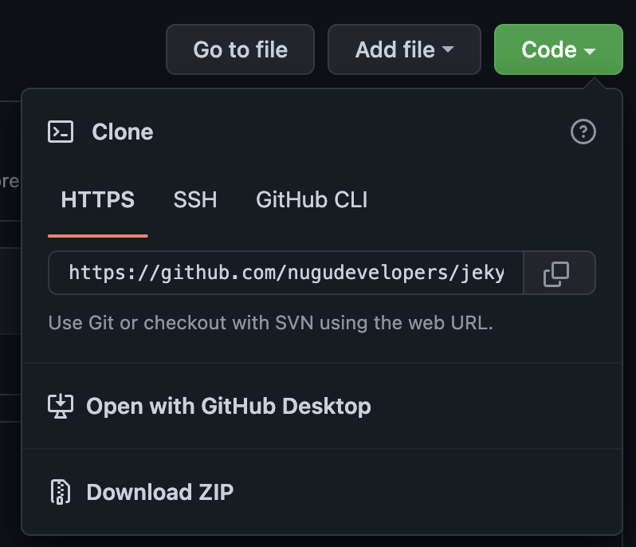

# 마이그레이션

해당 사용자는 [Jekyll](https://jekyllrb.com/) 에 대한 충분한 지식을 가지고 있음을 간주합니다.

구성된 문서 구조가 `디렉토리 구조`에 적합한지 입니다. 만일 이 구조에 맞지 않는 문서라면 `jekyll-potion` 을 적용할 수 없습니다.

또한 준비된 markdown 문서는 반드시 markdown 문법 구조에 맞아야 합니다.

## 컨텐츠 마이그레이션 하기

기본적으로 [Jekyll](https://jekyllrb.com/), [Liquid tag](https://shopify.dev/api/liquid/tags) 에서 지원하는 태그를 사용할 경우 문제는 없으나, 특정 서비스에 종속적인 태그를 사용할 경우 이를 제거합니다.

사용중인 태그중에 `jekyll-potion` 에서 제공하고 있는 기본 태그와 이름이 겹칠 경우 이를 변경합니다.

`jekyll-potion` 에서 제공하고 있는 기본 태그는 [tag](../components/tag) 에서 확인할 수 있습니다.

markdown 문서내 이미지, 링크중 배포환경에 맞도록 세팅된 URL 정보가 존재한다면, 이를 상대 경로화 합니다. `jekyll-potion` 은 rendering 결과 HTML 의 모든 `<a[href]>`, `` 의 상대 경로를 [Jekyll](https://jekyllrb.com/) 설정파일의 `url`, `baseurl` 을 조합하여 절대 경로화 합니다.

## layout 수정하기

기존에 사용중인 layout 이 있다 하더라도, `jekyll-potion` 은 layout 을 강제로 `default`, `error` 만 사용하도록 변경합니다.

따라서 사용중인 다른 layout 이 있다면, 이를 `default` 로 변경합니다.


`jekyll-potion`은 `:site`의 `:after_init` 시점에 설정된 `layouts_dir` 을 `jekyll-potion` theme 의 `layout_dir` 로게 변경합니다.

따라서 다른 layout 을 사용할 수 없습니다. 다만, 추후 다른 layout, [Jekyll](https://jekyllrb.com/) 의 기본 theme 도 함께 사용할 수 있도록 보강할 예정입니다.


## `jekyll-potion` 적용하기

1. GitHub 저장소 본문 우측 상단에 `Code` 버튼을 누르고 `Download ZIP` 을 선택하여 zip 파일을 다운로드 합니다.

   
2. 아래의 작업을 진행합니다.
   1. `_jekyll-potion` 폴더 복사
   2. `_plugins/jekyll-potion.rb` 복사 또는, [설정](../config) 를 참고하여, 설정파일을 변경합니다. `jekyll-potion` 내 설정이 아닌 경우 아래의 표를 참고합니다.

| 요소            | 설명                                                                                                                                        |
|:--------------|:------------------------------------------------------------------------------------------------------------------------------------------|
| `collections` | `jekyll-potion` 은 기본적으로 collection 을 사용하지 않습니다.                                                                                           |
| `markdown`    | `kramdown` 을 사용하고 있으며, `kramdown` 을 이미 사용한다면, `jekyll-potion` 의 설정을 제거합니다.                                                                |
| `sass`        | `jekyll-potion` 은 별도의 life-cycle 을 통해 scss 파일을 생성합니다. 이미 설정이 있다면 `jekyll-potion` 의 설정을 제거합니다.                                             |
| `plugins`     | `jekyll-potion` 은 종속성은 없지만, [Jekyll Spaceship](https://github.com/jeffreytse/jekyll-spaceship) 사용을 간주하고 개발되었습니다. 사용에 문제가 없다면 그대로 둡니다. |

## Site 구성하기

[사이트 설정](../config/site) 를 통해 Site 의 기본 정보를 설정합니다.

이후, 서버를 구동하여 문서들이 정상적으로 노출되는 것을 확인합니다.
