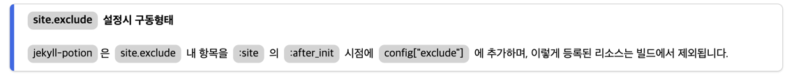

# alerts



`alerts` 는 정해진 유형의 시각화를 통해 사용자에게 강조된 내용을 제공합니다.

기본적인 선언은 다음과 같습니다.


```liquid

{content}

```


| 항목      | 유형       | 필수여부 | 설명                                                                                                                                                                                                                                                                   |
|---------|----------|------|----------------------------------------------------------------------------------------------------------------------------------------------------------------------------------------------------------------------------------------------------------------------|
| style   | enum     | Y    | style 은 시각화의 유형을 결정합니다.<br/>각 유형은 `proto` theme 에서 우측 측면에 다음의 색상으로 표현됩니다.<br/>* info : `#4169E1`<br/>* warning : `#FF8C00`<br/>* danger : `#8B0000`<br/>* success : `#008000`<br/>style 은 필수값이나, theme 별로 강제화된 값은 없습니다. 필요한 style 이 있다면, 그에 맞는 스타일이 존재한다면, 사용 가능합니다. |
| content | markdown |      | content 는 시각화를 통해 표현할 본문에 해당됩니다. 모든 markdown 문법을 지원하기 때문에 일반 문서 내용을 작성하듯 작성하면 됩니다.                                                                                                                                                                                   |

`alerts` 의 `proto` theme 의 기본 template, stylesheet 는 다음과 같습니다.

이 값은 새로운 theme 작성시 용도에 맞게 변경이 가능합니다.





```liquid
<div class="alerts {{ style }}">
    <div class="style"></div>
    <div class="body">{{ body }}</div>
</div>
```


**template 작성 항목**

| 변수명     | 필수여부 | 설명                                     |
|---------|------|----------------------------------------|
| `style` | Y    | 선언시 사용한 style                          |
| `body`  | Y    | 선언시 사용한 content 로서 markdown 으로서 표현됩니다. |




```scss
div.alerts {
  @extend %bordered-box;
  @extend %item-width;

  display: flex;

  & > div.style {
    width: 0.4em;
    border-radius: 0.5em 0 0 0.5em;
  }

  &.info > div.style {
    background-color: royalblue;
  }

  &.warning > div.style {
    background-color: darkorange;
  }

  &.danger > div.style {
    background-color: darkred;
  }

  &.success > div.style {
    background-color: green;
  }

  & > div.body {
    @extend %gap-grid-row;
    width: calc(100% - 0.4em);
    height: fit-content;
    margin: 0.5em 1em;

    img {
      width: auto;
      max-height: 6em;
    }
  }
}
```




