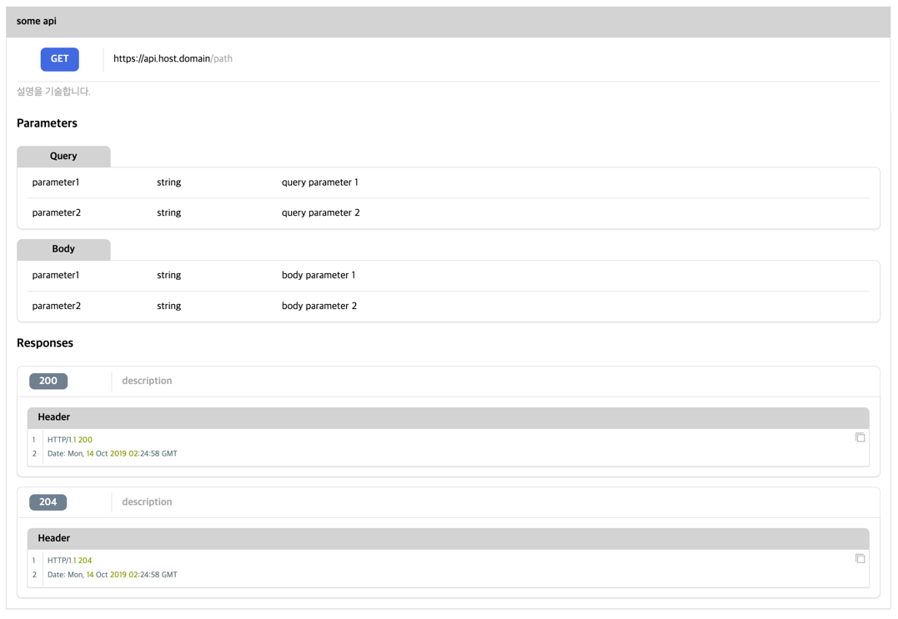

# api



`api` 는 영역을 구분하여, API 에 대해 효과적으로 사용자에게 제공합니다.

기본적인 선언은 다음과 같습니다.


````liquid



{description_content}



{parameter_content}



{response_content}



````


| 항목                  | 유형       | 필수여부 | 설명                                                                                           |
|---------------------|----------|------|----------------------------------------------------------------------------------------------|
| base_url            | string   |      | `api` 의 기본 URL 정보                                                                            |
| path                | string   | Y    | `api` 의 path 정보                                                                              |
| method              | string   | Y    | `api` 의 method 정보                                                                            |
| summary             | string   | Y    | `api` 의 제목에 해당되는 요약 정보                                                                       |
| api::description    | tag      |      | `api` 에 대한 기본적인 설명을 기술합니다.<br/>`api` tag 내 `api::`로 시작하는 tag 이외의 내용은 무시됩니다.                  |
| description_content | markdown |      | `api` 에 대한 기본적인 설명을 markdown 으로 작성합니다.                                                       |
| api::parameter      | tag      |      | `api` 에 필요한 parameter 를 기술로서 복수 개가 허용됩니다.<br/>`api` tag 내다른 `api::`로 시작하는 tag 이외의 내용은 무시됩니다. |
| name                | string   |      | parameter 의 이름                                                                               |
| type                | string   |      | parameter 의 타입                                                                               |
| category            | enum     |      | parameter 의 유형으로 query, body 중 하나를 선택                                                        |
| parameter_content   | markdown |      | parameter 에 대한 설명을 markdown 으로 작성합니다.                                                        |
| api::response       | tag      |      | `api` 의 응답으로 복수 개가 허용됩니다.<br/>`api` tag 내다른 `api::`로 시작하는 tag 이외의 내용은 무시됩니다.                 |
| status              | string   |      | `api` 응답의 HTTP status                                                                        |
| description         | string   |      | `api` 응답의 설명                                                                                 |
| response_content    | markdown |      | `api` 응답에 대한 설명을 markdown 으로 작성합니다.                                                          |


`api` tag 내 `api::` 로 시작하는 tag 이외의 다른 내용이 있을 경우 해당 내용은 무시됩니다.


`api` 의 `proto` theme 의 기본 template, stylesheet 는 다음과 같습니다.

이 값은 새로운 theme 작성시 용도에 맞게 변경이 가능합니다.





```liquid
<div class="api">
    <div class="header">
        <div class="title">{{ summary }}</div>
    </div>
    <div class="description">
        <div class="description-area">
            <div class="api-description">
                <div class="method"><label class="bold">{{ method | upcase }}</label></div>
                <div class="url">
                    <label>{{ base_url }}</label>
                    <label class="gray">{{ path }}</label>
                </div>
            </div>
            {{ description }}
        </div>
    </div>
    <div class="content">
        <div class="request-categories">
            <div class="large">Parameters</div>
            <div class="content">
                
                    <div class="category">
                        <div class="title">Query</div>
                        <div class="parameters">
                            {{ query_parameters }}
                        </div>
                    </div>
                
                
                    <div class="category">
                        <div class="title">Body</div>
                        <div class="parameters">
                            {{ body_parameters }}
                        </div>
                    </div>
                
            </div>
        </div>
        <div class="responses">
            <div class="large">Responses</div>
            <div class="content">
                {{ responses }}
            </div>
        </div>
    </div>
</div>

```


**template 작성 항목**

| 변수명                | 필수여부 | 설명                                                                   |
|--------------------|------|----------------------------------------------------------------------|
| `summary`          | Y    | API 의 제목                                                             |
| `method`           | Y    | API 의 HTTP method                                                    |
| `base_url`         |      | API 의 기본 url                                                         |
| `path`             | Y    | API 의 path                                                           |
| `description`      |      | API 에 대한 설명 영역으로 `api==description.liquid` 로 별도 템플릿으로 구성             |
| `query_parameters` |      | API 요청시 사용되는 query parameter 로 `api==parameter.liquid` 로 별도 템플릿으로 구성 |
| `body_parameters`  |      | API 요청시 사용되는 body parameter  로 `api==parameter.liquid` 로 별도 템플릿으로 구성 |
| `responses`        |      | 결과 영역으로  로 `api==response.liquid` 로 별도 템플릿으로 구성                      |


```liquid
<div class="content gray">
    {{ description }}
</div>
```


**template 작성 항목**

| 변수명            | 필수여부 | 설명                      |
|----------------|------|-------------------------|
| `description`  | Y    | API 설명으로 markdown 으로 구성 |


```liquid
<div class="parameter">
    <div class="name">{{ name }}</div>
    <div class="type">{{ type }}</div>
    <div class="description">{{ description }}</div>
</div>
```


**template 작성 항목**

| 변수명           | 필수여부 | 설명             |
|---------------|------|----------------|
| `name`        | Y    | parameter 명    |
| `type`        | Y    | parameter 유형   |
| `description` | Y    | parameter 의 설명 |


```liquid
<div class="response">
    <div class="header">
        <div class="status"><label>{{ status }}</label></div>
        <div class="description gray">{{ description }}</div>
    </div>
    <div class="content">{{ body }}</div>
</div>

```


**template 작성 항목**

| 변수명           | 필수여부 | 설명                               |
|---------------|------|----------------------------------|
| `status`      |      | 응답에 대한 HTTP Status               |
| `description` |      | 응답에 대한 설명                        |
| `body`        |      | 응답 결과에 대한 기술로서 markdown 이 허용됩니다. |




```scss
div.api {
  @extend %box;
  @extend %grid-row;
  margin-block-start: 1em;

  & > div.header {
    & > div.title {
      @extend %title-fixed;
      border-radius: 0;
    }
  }

  & > div.description {
    @extend %gap-grid-row;
    @include border(border-inline);

    & > div.description-area {
      @extend %gap-grid-row;
      @extend %item-width;
      margin: 1em auto;

      & > div.api-description {
        display: flex;

        & > div.method {
          @extend %center-middle;
          width: 10%;

          & > label {
            @include label(white, royalblue, 0.5em);
            padding-inline: 1em;
          }
        }

        & > div.url {
          @extend %left-middle;
          @include border(border-left);
          display: flex;
          padding-inline-start: 1em;
        }
      }

      & > div.content {
        @include border(border-top);
      }
    }
  }

  & > div.content {
    @extend %gap-grid-row;
    @include border(border-inline);
    @include border(border-bottom);
    @extend %shadow;
    border-radius: 0;
    padding-block-end: 1em;

    & > div.request-categories {
      @extend %item-width;
      @extend %gap-grid-row;
      margin-inline: auto;

      & > div.content {
        @extend %gap-grid-row;

        & > div.category {
          @extend %grid-row;

          & > div.title {
            @extend %center-middle;
            @extend %title-s-fixed;
            width: 150px;
          }

          & > div.parameters {
            @extend %content-fixed;

            border-radius: 0 0.5em 0.5em 0.5em;

            & > div.parameter {
              @include border(border-bottom);
              display: flex;
              padding: 0.5em;
              margin-inline: 1em;

              &:last-child {
                border-bottom: none;
              }

              & > div.name {
                flex: auto;
                width: 15%;
              }

              & > div.type {
                flex: auto;
                width: 15%;
              }

              & > div.description {
                flex: auto;
                width: 70%;
              }
            }
          }
        }
      }
    }

    & > div.responses {
      @extend %item-width;
      @extend %gap-grid-row;
      margin-inline: auto;

      & > div.content {
        @extend %gap-grid-row;

        & > div.response {
          @extend %grid-row;

          & > div.header {
            @extend %title-fixed;
            border-block-end: none;
            background-color: white;
            display: flex;

            & > div.status {
              width: 10%;

              & > label {
                @include label(white, slategray, 0.5em);
                padding-inline: 1em;
              }
            }

            & > div.description {
              @include border(border-left);
              padding-inline-start: 1em;
            }
          }

          & > div.content {
            @extend %gap-grid-row;
            @extend %content-fixed;
            padding-block: 1em;
          }
        }
      }
    }
  }
}
```




