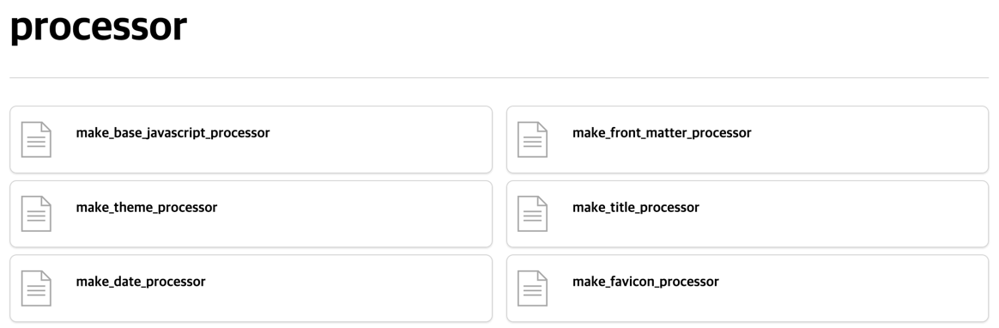

# empty



`empty` 는 본문이 없는 markdown 페이지 중 하위 페이지가 있을 경우, 하위 페이지의 목록을 보여주는 tag 로서 [make_empty_content_processor](../processor/make-empty-content-processor) 를 통해 자동으로 생성되며, 별도로 선언할 필요는 없습니다.

`empty` 의 `proto` theme 의 기본 template, stylesheet 는 다음과 같습니다.

이 값은 새로운 theme 작성시 용도에 맞게 변경이 가능합니다.





```liquid
<div class="block-row" data-skip-search-index>
    
        <div>
            <div class="block">
                <a class="block-body" href="{{ child.url }}">
                    <div class="thumb document"></div>
                    <div class="content">
                        <div class="bold">{{ child.title }}</div>
                        <div class="small">{{ child.description }}</div>
                    </div>
                </a>
            </div>
        </div>
    
</div>
```


**template 작성 항목**

| 변수명                      | 필수여부 | 설명                                                                                                                                                                                                                                                                                                           |
|--------------------------|------|--------------------------------------------------------------------------------------------------------------------------------------------------------------------------------------------------------------------------------------------------------------------------------------------------------------|
| `data-skip-search-index` | Y    | `data-skip-search-index` 은 [make_search_index_processor](../processor/make-search-index-processor)를 통해 검색 index 생성을 피하기 위한 keyword 입니다.<br/>모든 markdown 페이지의 본문, 제목, 설명은 검색 index 로 생성되기 때문에 `empty` tag 로 인해 생성되는 내용의 경우 검색 index 로 생성되면 안됩니다.<br/>때문에 `data-skip-search-index` 를 통해 중복된 index 생성을 피해야 합니다. |
| `potion.children`        | Y    | 하위 페이지 목록을 가르킵니다. for iteration 을 통해 하위 페이지를 rendering 함으로 반드시 사용되어야 합니다.                                                                                                                                                                                                                                    |
| `child`                  | Y    | 하위 페이지의 속성을 가르킵니다.                                                                                                                                                                                                                                                                                           |
| `child.url`              | Y    | 하위 페이지의 url 속성을 가르킵니다.                                                                                                                                                                                                                                                                                       |
| `child.title`            |      | 하위 페이지의 제목을 가르킵니다.                                                                                                                                                                                                                                                                                           |
| `child.description`      |      | 하위 페이지의 설명을 가르킵니다.                                                                                                                                                                                                                                                                                           |




```scss
div.block-row {
  @extend %box;
  display: flex;
  flex-wrap: wrap;
  margin-block-start: 1em;

  &.pagination {
    padding-block-start: 2em;
    @include border(border-top);
  }

  & > div {
    @extend %center-middle;
  }
}

div.block {
  @extend %clicked-box;

  height: fit-content;

  &.pagination {
    height: 6rem;
  }

  & > .block-body {
    @extend %left-middle;
    width: 100%;
    height: 100%;
    color: black;
    text-decoration: none;

    & > div.thumb {
      width: 4em;
      height: 4em;

      &.prev {
        @include left("darkgray", 80%);
      }

      &.next {
        @include right("darkgray", 80%);
      }

      &.document {
        @include document("darkgray", 70%);
      }

      &.file {
        @include file("darkgray", 70%);
      }

      &.link {
        @include link("darkgray", 60%);
      }
    }

    & > div.content {
      @extend %grid-row;
      width: calc(100% - 4em);
      height: fit-content;
      margin-inline: 1em;
      padding-block: 1em;

      & > * {
        @extend %left-middle;
        align-items: center;
        text-overflow: ellipsis;
        overflow: hidden;
        white-space: nowrap;
        min-height: 1em;
      }

      &.right > * {
        @extend %right-middle;
      }
    }
  }
}

div.block-row {
  row-gap: 0.5em;
  column-gap: 1em;

  & > div {
    flex: 0 0 calc(50% - 0.5em);
  }

  & > div:first-child:nth-last-child(1) {
    flex: 0 0 100%;
  }
}
```




