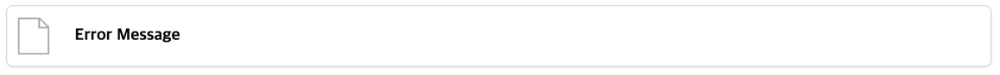

# file



`file` 은 다운로드가 필요한 정적 파일의 링크를 제공합니다.

기본적인 선언은 다음과 같습니다.


```liquid

```


| 항목      | 유형     | 필수여부 | 설명                                           |
|---------|--------|------|----------------------------------------------|
| src     | string | Y    | src 는 프로젝트 내 다운로드 대상 파일의 경로입니다.              |
| caption | string |      | caption 은 링크의 제목에 해당되며, 없을 경우 src 값으로 대체됩니다. |

`file` 의 `proto` theme 의 기본 template, stylesheet 는 다음과 같습니다.

이 값은 새로운 theme 작성시 용도에 맞게 변경이 가능합니다.





```liquid
<div class="block">
    <a class="block-body" href="{{ src }}" target="_blank" data-skip-href-to-absolute>
        <div class="thumb file"></div>
        <div class="content">
            <div class="large">{{ caption }}</div>
        </div>
    </a>
</div>
```


**template 작성 항목**

| 변수명                          | 필수여부 | 설명                                                                                                                                                      |
|------------------------------|------|---------------------------------------------------------------------------------------------------------------------------------------------------------|
| `src`                        | Y    | 선언시 사용한 src 반드시 프로젝트 내 다운로드가 가능한 파일이여야 합니다.                                                                                                             |
| `data-skip-href-to-absolute` | Y    | `data-skip-href-to-absolute` 는 [rewrite_a_href_processor](../processor/rewrite-a-href-processor)를 통해 `<a>` tag 의 모든 상대 경로를 절대 경로화 할 때 이를 제외하기 위해 사용합니다. |
| `caption`                    |      | 선언시 사용한 caption 으로 선언하지 않은 경우 src 로 표현됩니다.                                                                                                              |




```scss
div.block {
  @extend %clicked-box;

  height: fit-content;

  &.pagination {
    height: 6rem;
  }

  & > .block-body {
    @extend %left-middle;
    width: 100%;
    height: 100%;
    color: black;
    text-decoration: none;

    & > div.thumb {
      width: 4em;
      height: 4em;

      &.prev {
        @include left("darkgray", 80%);
      }

      &.next {
        @include right("darkgray", 80%);
      }

      &.document {
        @include document("darkgray", 70%);
      }

      &.file {
        @include file("darkgray", 70%);
      }

      &.link {
        @include link("darkgray", 60%);
      }
    }

    & > div.content {
      @extend %grid-row;
      width: calc(100% - 4em);
      height: fit-content;
      margin-inline: 1em;
      padding-block: 1em;

      & > * {
        @extend %left-middle;
        align-items: center;
        text-overflow: ellipsis;
        overflow: hidden;
        white-space: nowrap;
        min-height: 1em;
      }

      &.right > * {
        @extend %right-middle;
      }
    }
  }
}
```




