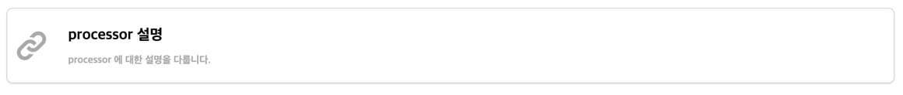

# link



`link` 는 내부/외부 페이지의 링크를 제공합니다.

내부 페이지인 경우 front-matter (또는 분석한 결과) 의 제목, 설명으로 노출되며, 외부 페이지인 경우 빌드 시점에 해당 페이지를 로딩하고, 로딩된 페이지의 HTML 요소중 `<title>` tag, `<meta[description]>` 를 획득하여 노출됩니다.

만일 페이지가 없거나, 불특정한 이유로 페이지를 분석 할 수 없는 경우엔 url 일 기준으로 노출되며, 링크에 대한 접근을 제한하지 않습니다.

기본적인 선언은 다음과 같습니다.


```liquid

```


| 항목      | 유형     | 필수여부 | 설명                                                                                   |
|---------|--------|------|--------------------------------------------------------------------------------------|
| url     | string | Y    | url 는 해당 링크의 접근 경로입니다.<br/>상대 경로를 입력할 경우, 프로젝트 내 파일로 인지하고 파일 정보를 기준으로 노출됩니다.         |
| caption | string |      | caption 은 링크의 제목에 해당되며, 없을 경우 외부 페이지인 경우 HTML 의 title, 내부 페이지인 경우 분석한 title 이 노출됩니다. |

`link` 의 `proto` theme 의 기본 template, stylesheet 는 다음과 같습니다.

이 값은 새로운 theme 작성시 용도에 맞게 변경이 가능합니다.





```liquid
<div class="block">
    <a class="block-body" href="{{ url }}">
        <div class="thumb link"></div>
        <div class="content">
            <div class="large">{{ title }}</div>
            <div class="small">{{ description }}</div>
        </div>
    </a>
</div>
```


**template 작성 항목**

| 변수명           | 필수여부 | 설명                                           |
|---------------|------|----------------------------------------------|
| `url`         | Y    | 선언시 사용한 url                                  |
| `title`       |      | 선언시 사용한 caption 으로 선언하지 않은 경우 분석된 제목이 노출됩니다. |
| `description` |      | 분석된 문서의 설명이 노출됩니다.                           |




```scss
div.block {
  @extend %clicked-box;

  height: fit-content;

  &.pagination {
    height: 6rem;
  }

  & > .block-body {
    @extend %left-middle;
    width: 100%;
    height: 100%;
    color: black;
    text-decoration: none;

    & > div.thumb {
      width: 4em;
      height: 4em;

      &.prev {
        @include left("darkgray", 80%);
      }

      &.next {
        @include right("darkgray", 80%);
      }

      &.document {
        @include document("darkgray", 70%);
      }

      &.file {
        @include file("darkgray", 70%);
      }

      &.link {
        @include link("darkgray", 60%);
      }
    }

    & > div.content {
      @extend %grid-row;
      width: calc(100% - 4em);
      height: fit-content;
      margin-inline: 1em;
      padding-block: 1em;

      & > * {
        @extend %left-middle;
        align-items: center;
        text-overflow: ellipsis;
        overflow: hidden;
        white-space: nowrap;
        min-height: 1em;
      }

      &.right > * {
        @extend %right-middle;
      }
    }
  }
}
```




