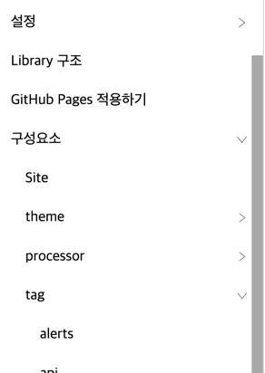

# navigation



`navigation` 는 디렉토리로 구조화된 메뉴 트리를 표현하는 tag 로서 layout 에서 사용됩니다.

기본적인 선언은 다음과 같습니다.


```liquid

```


`navigation` 의 `proto` theme 의 기본 template, javascript, stylesheet 는 다음과 같습니다.

이 값은 새로운 theme 작성시 용도에 맞게 변경이 가능합니다.





```liquid
<ul class="nav-menu">
    
        
    
</ul>
```


**template 작성 항목**

| 변수명               | 필수여부 | 설명                  |
|-------------------|------|---------------------|
| `navigation`      | Y    | markdown 페이지 목록     |
| `navigation-page` | Y    | markdown 페이지 링크 tag |


```liquid
<li data-nav-link-id="{{ potion.url }}">
    <div class="nav-link fold has-child " data-fold-target-id="{{ potion.url }}">
        <a href="{{ potion.url }}" class="nav-href" data-nav-link>{{ potion.title }}</a>
        <span class="nav-unfold" data-unfold-id="{{ potion.url }}"> </span>
        <span class="nav-fold" data-fold-id="{{ potion.url }}"> </span>
    </div>
    
        <ul class="nav-menu">
            
                
            
        </ul>
    
</li>
```


**template 작성 항목**

| 변수명                   | 필수여부 | 설명                                                                       |
|-----------------------|------|--------------------------------------------------------------------------|
| `potion.url`          | Y    | 분석된 페이지의 url                                                             |
| `potion.has_child?`   | Y    | 페이지의 하위 페이지 유무                                                           |
| `data-fold-target-id` |      | 하위 페이지가 있을 경우 접고 펼치는 기능에 대한 target id<br/>만일 접고 펼치는 기능이 필요하지 않을 경우 제외 가능 |
| `data-nav-link`       | Y    | javascript 를 통한 제어를 위한 key                                               |
| `potion.title`        | Y    | 분석된 페이지의 title                                                           |
| `data-unfold-id`      | Y    | 하위 페이지 목록을 접기 위한 key<br/>만일 접고 펼치는 기능이 필요하지 않을 경우 제외 가능                  |
| `data-fold-id`        | Y    | 하위 페이지 목록을 펼치기 위한 key<br/>만일 접고 펼치는 기능이 필요하지 않을 경우 제외 가능                 |
| `potion.children`     | Y    | 하위 페이지 목록                                                                |
| `navigation-page`     | Y    | 하위 페이지 markdown 페이지 링크 tag                                               |




```javascript
(($) => {
  class Navigation {
    constructor(options) {
      this.options = options
    }

    static matchPath(path, requestPath) {
      return new RegExp(path + '(/|/?#([^/]*))?$').test(requestPath)
    }

    init(pathname) {
      $('[data-unfold-id]:not([data-potion-handled])')
        .attr('data-potion-handled', 'true')
        .on('click', e => {
          $('[data-fold-target-id=\'' + $(e.currentTarget).attr('data-unfold-id') + '\']').removeClass('{{ fold_class }}')
        })

      $('[data-fold-id]:not([data-potion-handled])')
        .attr('data-potion-handled', 'true')
        .on('click', e => {
          $('[data-fold-target-id=\'' + $(e.currentTarget).attr('data-fold-id') + '\']').addClass('{{ fold_class }}')
        })

      let all_links = $('[data-nav-link-id]')
      all_links.removeClass('{{ active_class }}')

      let $selected = all_links.filter((_, nav_link) => Navigation.matchPath($(nav_link).attr('data-nav-link-id'), pathname))

      $selected.addClass('{{ active_class }}')
      $('[data-fold-target-id=\'' + pathname + '\']').removeClass('{{ fold_class }}')

      $selected.parents('[data-nav-link-id]').filter((_, p) => $(p).has($selected).length)
        .each((_, nav_link) => $('[data-fold-target-id=\'' + $(nav_link).attr('data-nav-link-id') + '\']').removeClass('{{ fold_class }}'))
    }
  }

  $.navigation = (options) => {
    return new Navigation(options)
  }
})(jQuery)
```


`jekyll-potion` 은 [jquery](http://jquery.com/) 를 사용합니다.

javascript 는 `{{ ~ }}` 을 포함한 template 이며, 설정에서 결정한 값을 매핑하여 javascript 파일을 생성합니다.

`{{ ~ }}` 구문은 [태그 설정](../../config/theme#태그-설정) 의 `theme[].tags.navigation` 항목을 참고해 주세요.

**함수 설명**

| 함수명    | 설명                                                                                                                                                                                                                                                                                                      |
|--------|---------------------------------------------------------------------------------------------------------------------------------------------------------------------------------------------------------------------------------------------------------------------------------------------------------|
| `init` | HTML 요소 내 `data-unfold-id`, `data-fold-id`, `data-nav-link-id` 로 설정한 attribute 를 찾고, `data-nav-link-id` 로 설정된 메뉴 링크에 대한 동작, 하위 메뉴에 대한 접기, 펼치기에 대한 event 처리를 초기화 합니다. event 를 추가한 다음 `data-potion-handled` attribute 를 추가하며, `data-potion-handled` attribute 가 추가된 HTML 요소에 대해서는 더 이상 event 를 추가하지 않습니다. |

**사용법**


```javascript
let navigation = $.navigation()

navigation.init() // 문서의 load, 갱신 시 호출해줍니다.
```






```scss
& > nav {
  flex: 0 0 300px;
  
  height: calc(100% - 5em);
  overflow-y: scroll;
  overflow-x: hidden;
  padding-block-start: 1em;
  @include border(border-right);
  
  & > div.nav-container {
    width: 100%;
    height: 100%;
    margin-inline-end: 0.8em;
  
    ul {
      display: block;
      list-style-type: none;
      margin-block: 0;
      margin-inline: 0;
      padding-inline-start: 0;
    }
  
    li {
      display: block;
      padding-inline-start: 1em;
  
      & > div.nav-link {
        display: flex;
        padding-block-start: 0.2em;
        padding-block-end: 0.5em;
        padding-inline-start: 0.3em;
        color: black;
  
        &:hover {
          background-color: gray;
          color: white;
        }
  
        & > a.nav-href {
          flex: auto;
          width: 90%;
          color: inherit;
          text-decoration: none;
        }
  
        %span-nav {
          width: 1em;
          flex: auto;
          display: none;
          color: inherit;
  
          &:hover {
            cursor: pointer;
          }
        }
  
        & > span.nav-unfold {
          @include unfold("black", 50%);
          @extend %span-nav;
        }
  
        & > span.nav-fold {
          @include fold("black", 50%);
          @extend %span-nav;
        }
  
        &.has-child {
          & > span.nav-unfold {
            display: none;
          }
  
          & > span.nav-fold {
            display: block;
          }
  
          & + ul.nav-menu {
            display: block;
          }
  
          &.fold {
            & > span.nav-unfold {
              display: block;
            }
  
            & > span.nav-fold {
              display: none;
            }
  
            + ul.nav-menu {
              display: none;
            }
          }
        }
      }
  
      &.active {
        & > div.nav-link {
          background-color: lightgray;
          @include border(border);
          border-inline: none;
          color: blue;
        }
      }
    }
  }
}
```




