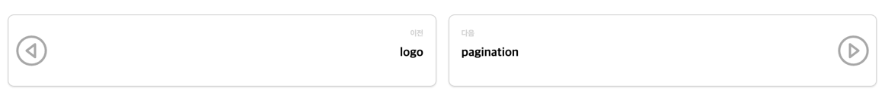

# pagination



`pagination` 는 현재 페이지를 기준으로 이전, 다음 페이지를 표현하는 tag 로서 layout 에서 사용됩니다.

기본적인 선언은 다음과 같습니다.


```liquid

```


`pagination` 의 `proto` theme 의 기본 template, stylesheet 는 다음과 같습니다.

이 값은 새로운 theme 작성시 용도에 맞게 변경이 가능합니다.





```liquid
<div class="block-row pagination" data-skip-search-index>
    
        <div>
            <div class="block pagination">
                <a class="block-body" href="{{ potion.before.url }}">
                    <div class="thumb prev"></div>
                    <div class="content right">
                        <div class="x-small">이전</div>
                        <div class="bold">{{ potion.before.title }}</div>
                        <div class="small">{{ potion.before.description }}</div>
                    </div>
                </a>
            </div>
        </div>
    
    
        <div>
            <div class="block pagination">
                <a class="block-body" href="{{ potion.after.url }}">
                    <div class="content">
                        <div class="x-small">다음</div>
                        <div class="bold">{{ potion.after.title }}</div>
                        <div class="small">{{ potion.after.description }}</div>
                    </div>
                    <div class="thumb next"></div>
                </a>
            </div>
        </div>
    
</div>
```


**template 작성 항목**

| 변수명                         | 필수여부 | 설명                                                                                                                                                                                                                                                                                                                |
|-----------------------------|------|-------------------------------------------------------------------------------------------------------------------------------------------------------------------------------------------------------------------------------------------------------------------------------------------------------------------|
| `data-skip-search-index`    | Y    | `data-skip-search-index` 은 [make_search_index_processor](../processor/make-search-index-processor)를 통해 검색 index 생성을 피하기 위한 keyword 입니다.<br/>모든 markdown 페이지의 본문, 제목, 설명은 검색 index 로 생성되기 때문에 `pagination` tag 로 인해 생성되는 내용의 경우 검색 index 로 생성되면 안됩니다.<br/>때문에 `data-skip-search-index` 를 통해 중복된 index 생성을 피해야 합니다. |
| `potion.has_before?`        | Y    | 현재 페이지의 이전 페이지 존재 유무                                                                                                                                                                                                                                                                                              |
| `potion.before.url`         | Y    | 현재 페이지의 이전 페이지 url                                                                                                                                                                                                                                                                                                |
| `potion.before.title`       |      | 현재 페이지의 이전 페이지 제목<br/>만일 제목을 대체할 다른 표현이 가능하다면 생략 가능                                                                                                                                                                                                                                                               |
| `potion.before.description` |      | 현재 페이지의 이전 페이지 설명<br/>만일 설명을 대체할 다른 표현이 가능하다면 생략 가능                                                                                                                                                                                                                                                               |
| `potion.has_after?`         | Y    | 현재 페이지의 다음 페이지 존재 유무                                                                                                                                                                                                                                                                                              |
| `potion.after.url`          | Y    | 현재 페이지의 다음 페이지 url                                                                                                                                                                                                                                                                                                |
| `potion.after.title`        |      | 현재 페이지의 다음 페이지 제목<br/>만일 제목을 대체할 다른 표현이 가능하다면 생략 가능                                                                                                                                                                                                                                                               |
| `potion.after.description`  |      | 현재 페이지의 다음 페이지 설명<br/>만일 설명을 대체할 다른 표현이 가능하다면 생략 가능                                                                                                                                                                                                                                                               |




```scss
div.block-row {
  @extend %box;
  display: flex;
  flex-wrap: wrap;
  margin-block-start: 1em;

  &.pagination {
    padding-block-start: 2em;
    @include border(border-top);
  }

  & > div {
    @extend %center-middle;
  }
}

div.block {
  @extend %clicked-box;

  height: fit-content;

  &.pagination {
    height: 6rem;
  }

  & > .block-body {
    @extend %left-middle;
    width: 100%;
    height: 100%;
    color: black;
    text-decoration: none;

    & > div.thumb {
      width: 4em;
      height: 4em;

      &.prev {
        @include left("darkgray", 80%);
      }

      &.next {
        @include right("darkgray", 80%);
      }

      &.document {
        @include document("darkgray", 70%);
      }

      &.file {
        @include file("darkgray", 70%);
      }

      &.link {
        @include link("darkgray", 60%);
      }
    }

    & > div.content {
      @extend %grid-row;
      width: calc(100% - 4em);
      height: fit-content;
      margin-inline: 1em;
      padding-block: 1em;

      & > * {
        @extend %left-middle;
        align-items: center;
        text-overflow: ellipsis;
        overflow: hidden;
        white-space: nowrap;
        min-height: 1em;
      }

      &.right > * {
        @extend %right-middle;
      }
    }
  }
}

div.block-row {
  row-gap: 0.5em;
  column-gap: 1em;

  & > div {
    flex: 0 0 calc(50% - 0.5em);
  }

  & > div:first-child:nth-last-child(1) {
    flex: 0 0 100%;
  }
}
```




