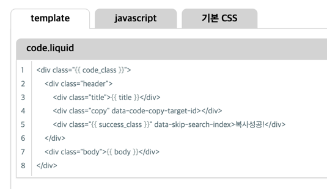

# tabs



`tabs` 는 탭 interface 를 활용하여 구분된 내용을 정해진 유형의 시각화를 통해 사용자에게 강조된 내용을 제공합니다.

기본적인 선언은 다음과 같습니다.


```liquid



{content #n}



```


| 항목            | 유형       | 필수여부 | 설명                                                                                 |
|---------------|----------|------|------------------------------------------------------------------------------------|
| title         | string   | Y    | title 은 탭을 구분할 수 있는 제목입니다.                                                         |
| tabs::content | tag      |      | 탭의 본문을 표시하기 위한 tag 입니다. tabs tag 에서 이 영역 이외의 내용은 무시됩니다.                            |
| content #n    | markdown |      | content 는 markdown 으로 작성된 탭의 본문입니다. 모든 markdown 문법을 사용할 수 있으나, 탭 내 탭을 구성할 수는 없습니다. |


`tabs` tag 내 `tabs::content` 이외의 다른 내용이 있을 경우 해당 내용은 무시됩니다.


`tabs` 의 `proto` theme 의 기본 template, javascript, stylesheet 는 다음과 같습니다.

이 값은 새로운 theme 작성시 용도에 맞게 변경이 가능합니다.





```liquid
<div id="{{ id }}" class="{{ tabs_class }}">
    <ul class="tabs_title">
        
            <li data-tabs-content-id="{{ tab.id }}" class="tab-title {{ active_class }}">{{ tab.title }}</li>
        
    </ul>
    {{ contents }}
</div>
```


**template 작성 항목**

| 변수명                    | 필수여부 | 설명                                                                 |
|------------------------|------|--------------------------------------------------------------------|
| `id`                   | Y    | 문서내 tabs 를 식별하기 위한 id<br/>`tabs-{lineNumber}` 와 같은 형태로 생성          |
| `tabs_class`           | Y    | `tabs` 태그로 인해 생성되는 HTML Root 태그에 부여할 class name                    |
| `tabs`                 | Y    | 각 tab 을 구성하는 tab 목록                                                |
| `tab`                  | Y    | tab 정보                                                             |
| `data-tabs-content-id` | Y    | 각 tab 을 선택할 수 있는 식별자 id<br/>`tabs-content-{lineNumber} 와 같은 형태로 생성 |
| `tab.id`               | Y    | 각 tab 을 선택하기 위한 id<br/>`tab-content-{lineNumber}` 와 같은 형태로 생성      |
| `tab.first`            | Y    | `tabs` 내 첫번째 tab 여부                                                |
| `active_class`         | Y    | tab 이 활성화 되었을 때 부여할 class name                                     |
| `tab.title`            | Y    | tab 제목                                                             |
| `contents`             | Y    | tab content 표현을 위한 변수                                              |


```liquid
<div id="{{ id }}" class="tab-content {{ active_class }}">
    <div class="content">
        {{ body }}
    </div>
</div>
```


**template 작성 항목**

| 변수명               | 필수여부 | 설명                                                            |
|-------------------|------|---------------------------------------------------------------|
| `id`              | Y    | 각 tab 을 선택하기 위한 id<br/>`tab-content-{lineNumber}` 와 같은 형태로 생성 |
| `first`           | Y    | 첫번째 tab 여부                                                    |
| `active_class`    | Y    | tab 이 활성화 되었을 때 부여할 class name                                |
| `body`            | Y    | tab 본문                                                        |




```javascript
(($) => {
  class Tabs {
    constructor(options) {
      this.options = options
    }

    init() {
      let tabNavs = $('.{{ tabs_class }}').find('[data-tabs-content-id]:not([data-potion-handled])')

      tabNavs.attr('data-potion-handled', 'true')
        .on('click', e => {
          e.preventDefault()

          let $clicked = $(e.currentTarget)

          parent = $clicked.parents('.tabs')
          parent.find('[data-tabs-content-id]')
            .removeClass('{{ active_class}}')
            .each((_, nav) => {
              parent.find('[id=\'' + $(nav).attr('data-tabs-content-id') + '\']').removeClass('{{ active_class }}')
            })

          $clicked.addClass('{{ active_class }}')
          $('#' + $clicked.attr('data-tabs-content-id')).addClass('{{ active_class }}')
        })

      return tabNavs
    }
  }

  $.tabs = (options) => {
    return new Tabs(options)
  }
})(jQuery)
```


`jekyll-potion` 은 [jquery](http://jquery.com/) 를 사용합니다.

javascript 는 `{{ ~ }}` 을 포함한 template 이며, 설정에서 결정한 값을 매핑하여 javascript 파일을 생성합니다.

`{{ ~ }}` 구문은 [태그 설정](../../config/theme#태그-설정) 의 `theme[].tags.tabs` 항목을 참고해 주세요.

**함수 설명**

| 함수명    | 설명                                                                                                                                                                                                                                                                |
|--------|-------------------------------------------------------------------------------------------------------------------------------------------------------------------------------------------------------------------------------------------------------------------|
| `init` | HTML 요소 내 `tabs_class`, `data-tabs-content-id` 로 설정한 attribute 를 찾고, `data-tabs-content-id` 로 설정된 tab 의 링크에 event 처리를 초기화 합니다. event 를 추가한 다음 `data-potion-handled` attribute 를 추가하며, `data-potion-handled` attribute 가 추가된 HTML 요소에 대해서는 더 이상 event 를 추가하지 않습니다. |

**사용법**


```javascript
let tabs = $.tabs()

tabs.init() // 문서의 load, 갱신 시 호출해줍니다.
```






```scss
div.tabs {
  @extend %box;
  @extend %item-width;

  & > ul {
    display: flex;
    column-gap: 0.5em;
    padding: 0;
    margin: 0 0 -1px;

    & > li.tab-title {
      @extend %title-fixed;
      display: block;
      padding: 0 2em;
      border-block-end: none;

      &.active {
        background-color: white;
      }

      &:hover {
        cursor: pointer;
      }
    }
  }

  & > div.tab-content {
    @include border(border);
    @extend %shadow;

    border-radius: 0 0.5em 0.5em 0.5em;
    padding: 1em 0.5em;
    display: none;

    &.active {
      display: block;
    }

    & > div.content {
      @extend %gap-grid-row;

      & > .code {
        width: 100%;
      }
    }
  }
}
```




